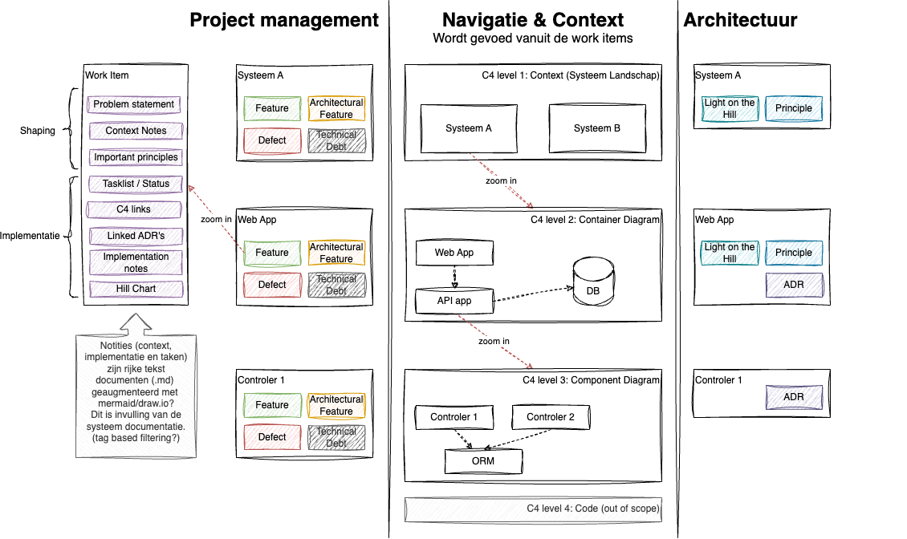

# Documentatie voor Lighthouse Visualisatie

Deze visualisatie geeft een overzicht van hoe **Lighthouse** werkt, en laat zien hoe **projectmanagement**, *
*navigatie & context**, en **architectuur** naadloos geïntegreerd zijn om systeemontwerpers en ontwikkelteams te
ondersteunen in hun werk. De visualisatie is opgedeeld in drie hoofdsecties: **Project management**, **Navigatie &
Context**, en **Architectuur**.

## 1. Project Management

In Lighthouse worden **work items** beheerd als de centrale eenheden van werk. Elk work item valt binnen één van vier
categorieën, namelijk **Feature**, **Architectural Feature**, **Defect**, of **Technical Debt**.

- **Features** zijn nieuwe functies die aan een systeem moeten worden toegevoegd.
- **Architectural Features** richten zich op verbeteringen of uitbreidingen in de architectuur van het systeem.
- **Defects** zijn bugs of problemen in het systeem die moeten worden opgelost om een goed functionerende applicatie te
  garanderen.
- **Technical Debt** verwijst naar technische schulden die moeten worden aangepakt om toekomstige onderhoudbaarheid en
  ontwikkeling van het systeem te verbeteren.

### Shaping en Implementatie

De ontwikkeling van een work item verloopt in twee fasen: **shaping** en **implementatie**.

#### Shaping

In de shaping-fase worden de contouren van een work item gedefinieerd en voorbereid voor implementatie. Dit is het
moment waarop het probleem, de context en de relevante architectonische principes worden vastgelegd. Elk work item
begint met een **problem statement**, waarin het specifieke probleem dat moet worden opgelost, kort wordt beschreven.
Dit helpt het team om zich te concentreren op wat het werkelijke doel is en welke impact het werk zal hebben op het
systeem.

Naast de probleemstelling worden **context notes** toegevoegd om de bredere context te schetsen. Deze context helpt om
te begrijpen hoe dit work item past binnen het grotere geheel van het systeem. Bovendien worden ook de **important
principles** opgenomen in deze fase, wat helpt om het werk in lijn te brengen met de bredere architectonische en
strategische richtlijnen. De principes dienen als leidraad voor ontwerpbeslissingen tijdens de implementatie en zorgen
ervoor dat het werk strookt met de vastgestelde strategie.

Cruciaal in deze fase is ook het gebruik van **C4 links**. Deze worden tijdens de shaping-fase gebruikt om te begrijpen
**waar** in het systeem het work item zich bevindt. Dit geeft een overzicht van de systeemonderdelen die door het werk
worden beïnvloed en biedt de nodige context voor de rest van het team.

#### Implementatie

De implementatiefase is waar het daadwerkelijke werk wordt uitgevoerd. Het werk wordt niet gevolgd door een traditionele
takenlijst voor tracking. In plaats daarvan gebruikt Lighthouse een **Hill Chart** als visuele tracking-methode. De Hill
Chart weerspiegelt de **expert opinie** van de engineer en biedt een overzicht van de voortgang en de mogelijke
uitdagingen. In plaats van een gedetailleerde lijst van taken, geeft de Hill Chart een overzicht van waar het team zich
bevindt ten opzichte van de volledige implementatie.

**Tasklists** worden gebruikt als mentale notities voor de persoon die het werk implementeert, maar ze worden niet
gebruikt voor tracking. Dit is eerder een hulpmiddel voor de implementator om gedachten te structureren zonder dat deze
officieel wordt gevolgd door het team.

Tijdens de implementatie kunnen nieuwe beslissingen noodzakelijk worden, en dit is waar **Architectural Decision
Records (ADR's)** naar voren komen. ADR's zijn niet altijd van tevoren genomen, maar ontstaan wanneer er een belangrijke
ontwerpbeslissing nodig is. Deze beslissingen worden formeel vastgelegd als ADR’s tijdens het implementatieproces. Er is
ook een **link met eerdere ADR's** via het C4-model, zodat relevante eerdere beslissingen binnen een bepaalde context
zichtbaar blijven.

De **C4 links** in de implementatiefase hebben een andere functie dan in de shaping-fase. Hier worden ze gebruikt om aan
te geven **wat er verandert** in de architectuur, bijvoorbeeld wanneer een externe service wordt geïmplementeerd of
wanneer een nieuw component wordt toegevoegd.

Tot slot worden tijdens de implementatie **implementation notes** vastgelegd. Deze notities bevatten feitelijke
informatie over wat er is gedaan tijdens de implementatie, zonder beslissingen op te nemen (die staan in de ADR's). Dit
kunnen technische details zijn over de implementatie en hoe het werk is uitgevoerd.

### Documentatie en Integratie

Een cruciaal onderdeel van het documentatieproces in Lighthouse is het gebruik van **rijke tekstdocumenten** voor het
vastleggen van context, implementatienotities en taken. Deze documenten worden opgeslagen in `.md`-bestanden en kunnen
worden verrijkt met diagrammen die zijn gemaakt in tools zoals **Mermaid** of **Draw.io**. Deze visualisaties helpen om
complexe technische concepten duidelijk over te brengen. Bovendien kan er gebruik worden gemaakt van tag-based filtering
om snel relevante informatie te vinden binnen de documentatie. Door de koppeling van work items aan de bredere
documentatie ontstaat er een compleet overzicht van het systeem en zijn evolutie.

## 2. Navigatie & Context

### C4-modellen

Lighthouse gebruikt **C4-modellen** om het systeemlandschap visueel weer te geven en context te bieden aan work items.
Het C4-model bestaat uit verschillende niveaus, waarmee gebruikers kunnen inzoomen op het systeem:

- **C4 level 1: Context (Systeemlandschap)**  
  Dit toont het overzicht van het hele systeemlandschap, met verschillende systemen zoals **Systeem A** en **Systeem B
  **. Hier wordt de context van de systemen weergegeven, waarbij work items zijn gekoppeld aan deze systemen.

- **C4 level 2: Container Diagram**  
  Dit niveau laat de verschillende containers binnen een systeem zien, zoals een **Web App** en een **API App**. Work
  items die betrekking hebben op een specifieke container zijn hier aan gekoppeld.

- **C4 level 3: Component Diagram**  
  Dit niveau toont de componenten binnen een container, zoals **Controller 1** en **ORM**. Work items die gerelateerd
  zijn aan specifieke componenten worden op dit niveau gekoppeld.

- **C4 level 4: Code**  
  Dit niveau, waarin specifieke code wordt getoond, valt **buiten de scope** van Lighthouse.

### Koppeling met Work Items

De work items zijn direct gekoppeld aan de verschillende C4-niveaus. Dit betekent dat voor elk work item (zoals een
feature of technical debt) kan worden gevisualiseerd **waar** in het systeem het zich bevindt tijdens shaping en **wat**
er verandert tijdens implementatie. Deze koppeling maakt het mogelijk om eenvoudig door het systeemlandschap te
navigeren en te zien welke onderdelen worden beïnvloed door bepaalde werkzaamheden of beslissingen.

## 3. Architectuur

### Architecturale Componenten

Ieder systeem en elke container of component heeft drie belangrijke architectuurelementen:

- **Light on the Hill (LotH)**: Dit is de strategische visie voor het systeem, container of component. Het geeft
  richting aan de beslissingen die binnen dit onderdeel van het systeem worden genomen.
- **Principles**: Dit zijn de belangrijkste architectonische principes die van toepassing zijn op het systeem of de
  component. Deze principes helpen bij het sturen van beslissingen die binnen de teams worden genomen.
- **ADR's (Architectural Decision Records)**: Dit zijn vastgelegde ontwerpbeslissingen die de architectuur van het
  systeem vormen. ADR's helpen om te begrijpen welke keuzes in het verleden zijn gemaakt en waarom.

### Relatie met Work Items

De architectuurelementen zoals de **LotH**, **principes** en **ADR's** zijn gekoppeld aan C4 componenten en onderliggend
de work items. Dit zorgt ervoor dat beslissingen en de context waarin ze zijn genomen, altijd inzichtelijk zijn tijdens 
het uitvoeren van werk. Het systeem blijft op deze manier **evolueerbaar**, omdat de context van beslissingen altijd 
zichtbaar is en nieuwe beslissingen in lijn zijn met eerdere keuzes.

---

## Conclusie

Deze visualisatie toont de kracht van **Lighthouse** in het samenbrengen van **projectmanagement**, **architectuur** en
**systeemnavigatie**. Door work items direct te koppelen aan het C4-model, biedt Lighthouse niet alleen een manier om
werk te beheren, maar ook een diepere context om te begrijpen hoe elke actie en beslissing het systeem beïnvloedt. Door
de **C4 links** te gebruiken in zowel de **shaping**- als de **implementatiefase**, krijgen teams een volledig beeld van
hun systeem en hoe hun werk dit beïnvloedt.

[Pricing Strategy](pricing.md)
[Light on the Hill](../README.md)